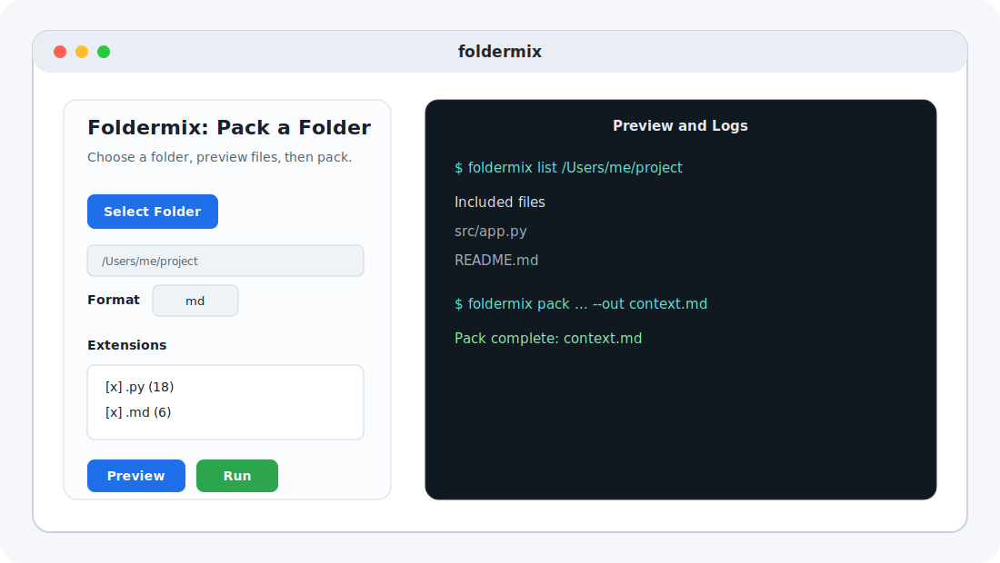

# foldermix Desktop

[](https://github.com/foldermix/foldermix-desktop/actions/workflows/release.yml)
[](LICENSE)
[](Package.swift)
[](Package.swift)

Native macOS app for [foldermix](https://github.com/foldermix/foldermix), the open-source tool
that packs a local folder into one LLM-ready context file.

Created by [Shay Palachy Affek](http://www.shaypalachy.com/).

## What This Is

`foldermix-desktop` is the point-and-click macOS surface for foldermix. It wraps the same CLI used
by the Python package and gives users a simple local workflow:

1. Choose a folder.
2. Preview included and skipped files.
3. Select output format and file extensions.
4. Pack the folder into one `.md`, `.xml`, or `.jsonl` context artifact.

The app is designed for users who want foldermix without remembering CLI flags, and for developers
who want a native packaging surface next to the scriptable CLI.

## App Layout



## Current Status

This is a v0 macOS app. The current implementation supports:

- folder selection through the native macOS open panel,
- preview via `foldermix list` and `foldermix skiplist --conversion-check`,
- extension include filters populated from the preview output,
- manual extension entry,
- output path and output format selection,
- `foldermix pack` execution with terminal-style logs,
- standard and OCR-enabled DMG builds.

Current limitations:

- macOS only; no Windows or Linux desktop build is planned in this repository.
- Release DMGs are ad-hoc signed, so macOS may require right-click `Open` on first launch.
- The checked-in visual above is a UI map, not a captured product screenshot. A real screenshot
  should be added under `docs/assets/` once a release build can be captured consistently.

## Download

Latest release assets use stable URLs:

- [foldermix-desktop.dmg](https://github.com/foldermix/foldermix-desktop/releases/latest/download/foldermix-desktop.dmg)
- [foldermix-desktop-full.dmg](https://github.com/foldermix/foldermix-desktop/releases/latest/download/foldermix-desktop-full.dmg) - includes OCR support for scanned and image-only PDFs

The standard DMG bundles the foldermix CLI without OCR extras. The full DMG bundles the OCR-capable
CLI and is larger.

## Relationship to the CLI

The desktop app delegates packing work to the foldermix CLI:

- release builds bundle a frozen `foldermix-cli` executable inside the `.app`,
- local development builds can use an installed `foldermix` on `PATH`,
- the app also searches common pyenv and Homebrew locations before running commands.

Core packing behavior, supported output formats, conversion support, and policy checks live in
[foldermix/foldermix](https://github.com/foldermix/foldermix). This repository owns only the
macOS app wrapper and DMG packaging.

## Local Development

Requirements:

- macOS 13 Ventura or newer
- Xcode command line tools
- Swift 5.9 or newer
- Python 3 for release packaging
- Pillow when running `scripts/build_dmg.sh`, because the build script generates the app icon
- `uv` when building against a sibling local `foldermix` checkout

Build and run the Swift app from source:

```bash
swift run FoldermixDesktop
```

For source-level testing, install the CLI separately or keep a sibling checkout at `../foldermix`.

## Build DMGs

Build the standard DMG:

```bash
./scripts/build_dmg.sh <app-version>
```

Build the OCR-enabled DMG:

```bash
./scripts/build_dmg.sh <app-version> --full
```

Outputs are written under `build/`:

```text
build/foldermix-v<app-version>.dmg
build/foldermix-v<app-version>-full.dmg
```

The packaged foldermix CLI version is pinned in [foldermix-version.txt](foldermix-version.txt).

## Troubleshooting

If the app cannot run foldermix in a local development build:

- install the CLI with `pip install foldermix`,
- or build the DMG so the CLI is bundled into the app,
- or confirm that `foldermix` is available in one of the searched paths:
  - `$HOME/.pyenv/shims`
  - `/opt/homebrew/bin`
  - `/usr/local/bin`
  - standard system shell paths.

If preview or packing fails, the right pane shows the exact command output and exit code from the
underlying CLI.

## Repository Map

| Path | Purpose |
|---|---|
| `Sources/FoldermixDesktop/` | AppKit application source |
| `scripts/build_dmg.sh` | Release packaging script for standard and OCR DMGs |
| `foldermix-version.txt` | Pinned CLI version for release packaging |
| `.github/workflows/release.yml` | macOS release workflow that uploads DMG assets |
| `docs/assets/` | README visuals and future screenshots |

## Related Repositories

- [foldermix/foldermix](https://github.com/foldermix/foldermix) - CLI, library, and core documentation.
- [foldermix/foldermix.github.io](https://github.com/foldermix/foldermix.github.io) - product website.

## License

This app is released under the [MIT License](LICENSE).

## Credits

Created by [Shay Palachy Affek ](http://www.shaypalachy.com/) [[GitHub](https://github.com/shaypal5)]
